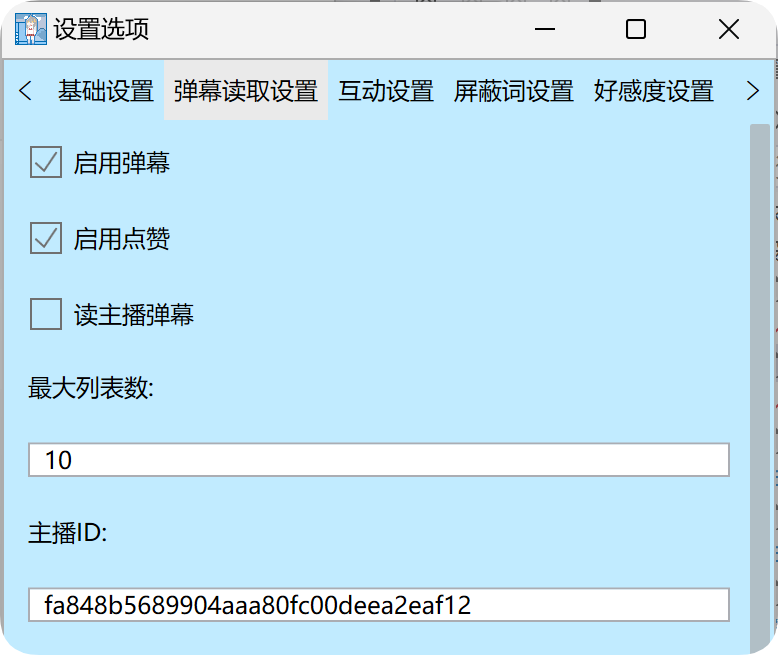
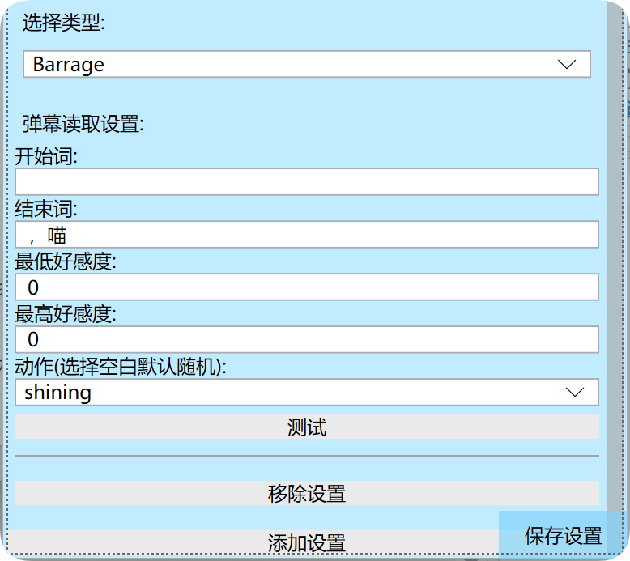
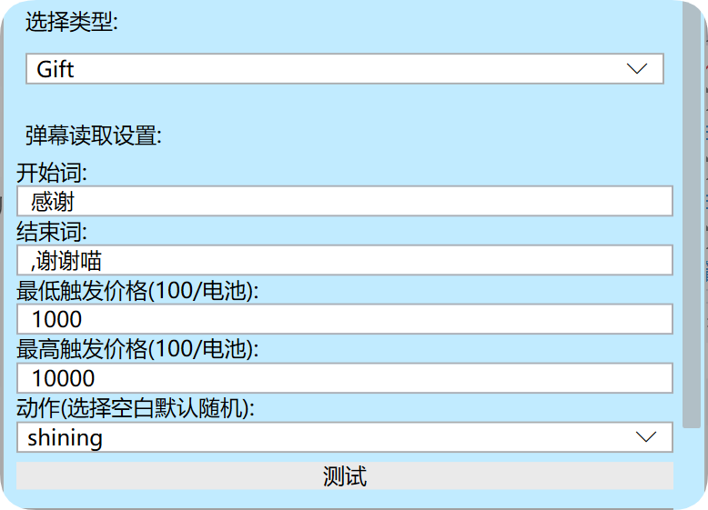
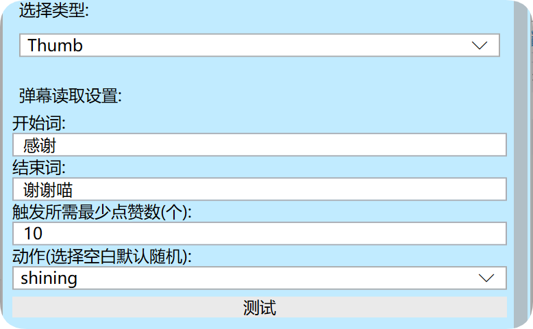
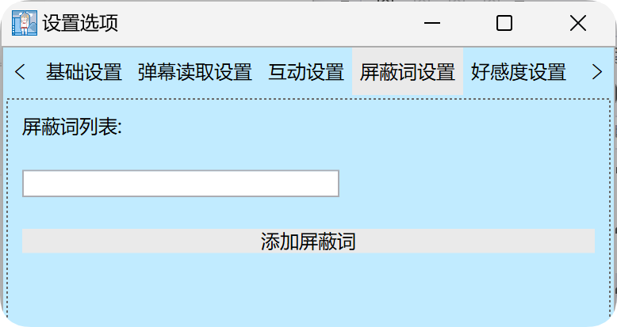
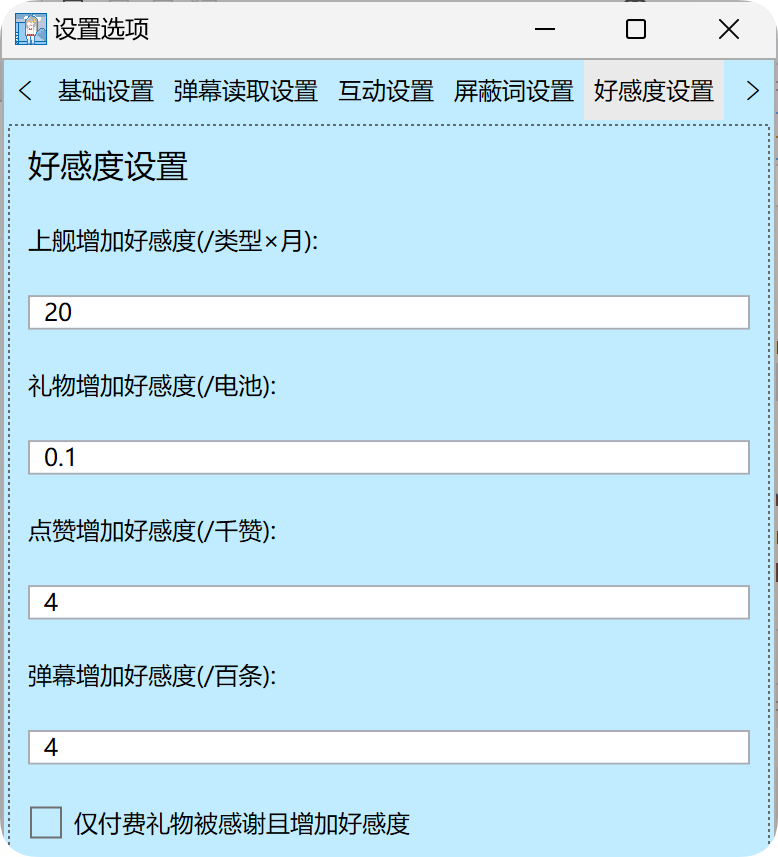

# 声明

1. 本互动插件使用开源项目[LorisYounger/VPet: 虚拟桌宠模拟器](https://github.com/LorisYounger/VPet) ，已获得制作者的准许

2. 本互动插件会收集互动者信息并储存，用于插件互动的判断

3. 本插件具有完备日志功能，如有使用问题，请查找对应日志，联系作者楚依云(dcyy200@163.com)

# 基础玩法

1. 本插件有两种互动，喂食(增减金钱)和摸头/转圈圈(调用动作)

2. 本插件对发弹幕，点赞，送礼，充电弹幕和上舰均有读弹幕/致谢处理

3. 对于读弹幕内容，主播可自行设置屏蔽词

4. 本插件具有好感度设定，主播可自行设置互动增加的好感度，并设置解锁互动的最低好感度

# 使用方法

1. 基础使用：双击运行start.exe，在弹出的桌宠处鼠标右击，点击 自定，B站主播助手萝莉丝，填写主播码，点击启动即可使用

2. 自动登录：在第一次登录后本mod会将输入的主播码保存在本地，在登录界面勾选自动登录，即可在下一次打开桌宠的时候自动登录

3. 关闭插件：在登录界面点击停止即可关闭直播互动插件且不关闭桌宠，直接关闭桌宠也可自动关闭直播插件

# 观众使用方法

## 互动：

1. 观众发送包含你设置的关键词和一个数字(代表互动时长,单位秒)的弹幕可进行互动(例如"摸头5秒"，"摸头5")，
   
   弹幕互动需消耗"金钱"(通过一切给主播带来现金收益的方式获得，在1:1兑换的情况下100金钱对应1电池)

2. 送出你指定的礼物可执行指定互动，互动时间为(礼物数量*你设置的时长单位秒)

# 设置面板

## 打开方式

鼠标右击桌宠，点 系统，mod设置，B站主播助手萝莉丝即可打开设置面板

## 注意事项

***<u><mark>一定要在设置完所有内容后点击右下角保存设置，否则你将丢失本次设置的所有的内容</mark></u>***

## 弹幕读取设置

### 基础设置



1. 启用弹幕:启用读弹幕功能

2. 启用点赞:启用点赞致谢功能

3. 读主播弹幕:选择是否读自己的弹幕

4. 最大列表数:弹幕和点赞总共的最大储存数量，多余此数量将抛弃存储列表中最早的弹幕

5. 主播ID:主播自己的唯一身份码，在首次登录后会自动获取并存储

### 内容设置

#### 类型

对于阅读功能，有五种类型，分别是Barrage(读弹幕)，Gift(礼物致谢)，Thumb(点赞致谢)，Guard(上舰致谢)，SuperChat(充电弹幕)，点击"移除设置"可以移除上方的设置，点击"添加设置"可添加一条和下拉框类型对应的设置

#### 具体内容

##### Barrage

1. 开始词(通用，后面不再介绍):读弹幕中开始的那个词，可为空

2. 结束词(通用，后面不再介绍):读弹幕中结束的那个词，可为空

3. 最低好感度，最高好感度：二者配合，共同限制读弹幕，当发弹幕的人好感度在此区间，则调用此设置，多条设置最好不要有重合部分，有重合部分的情况下，使用包含此重合部分的第一条设置

4. 动作(通用，后面不再介绍):使用此动作进行读弹幕，不填写的情况下，如果桌宠此时处于空闲状态，则随机挑选一个读相关的动作，否则不改变桌宠当前动作

##### Gift

1. 最低触发金额，最高触发金额：二者配合，共同限制礼物致谢，当发送礼物的金额在此区间则调用此设置，存在重合部分处理同好感度，每100对应一个电池(比如最低100，最高1000为1-10电池)

2. 礼物致谢功能还有一部分设置在好感度设置("仅付费礼物被阅读并增加好感度")，作用同名字

##### Thumb

1. 触发所需最少点赞数：用户每两秒的点赞高于此数值，则将对其致谢

2. 其余部分并没有单独的设置，不再单独展示

## 互动设置

互动功能目前为残次品，除好感度外暂时不支持自定义

## 屏蔽词设置

点击添加屏蔽词，在屏蔽词列表中输入想添加的屏蔽词即可添加

## 好感度设置

1. 上舰增加好感度：每上一个月的舰长为上舰用户增加你填写的好感度数值，提督×2，总督×3

2. 礼物增加好感度：按照礼物总价值，为送礼用户增加礼物总价值×你设置的值对应的好感度

3. 点赞增加好感度：按照点赞总数，每1000个赞为送礼用户增加你设置的值对应的好感度

4. 弹幕增加好感度：按照弹幕总数，每100条弹幕为发弹幕的用户增加你设置的值对应的好感度

5. 仅付费礼物被感谢且增加好感度：只有付费礼物会增加用户的好感度数值，并被感谢
